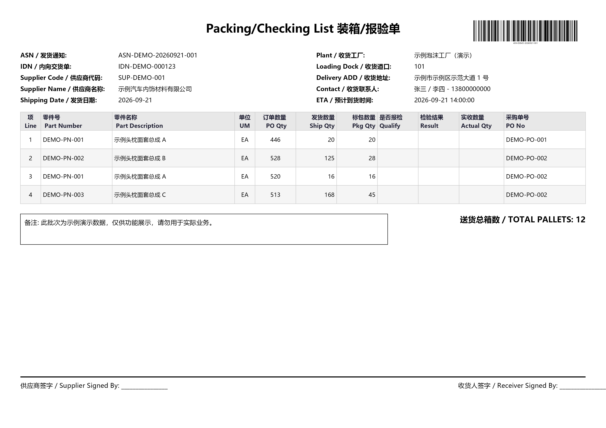
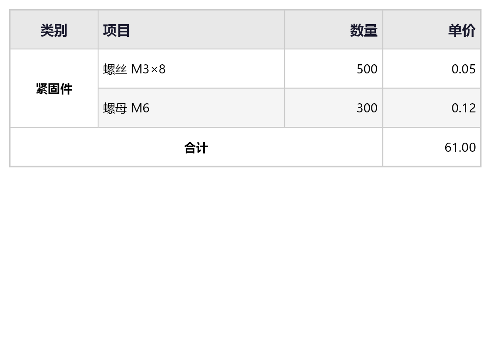
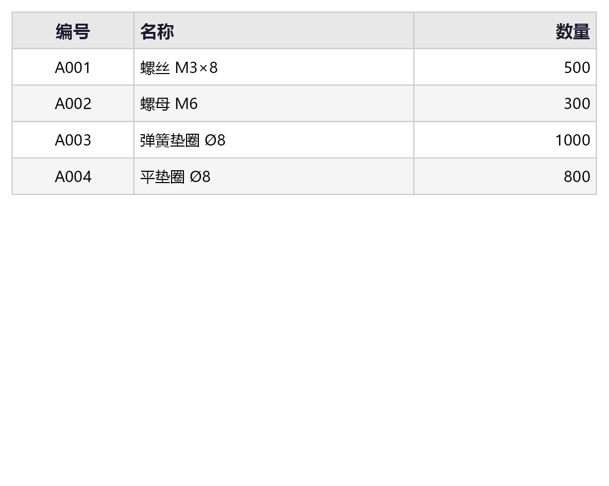

# PrintLibrary — Cross-Platform Printing Library for Enterprises

A cross-platform printing library built on **SkiaSharp** + **ZXing.Net** for Windows, Linux, and macOS. Supports barcode labels, A4 reports, PDF output, and real-time preview.

---

## Quick Start

### 1. Install Dependencies

Add the following NuGet packages to `PrintLibrary.Core`:

```bash
dotnet add package SkiaSharp
dotnet add package SkiaSharp.NativeAssets.Linux.NoDependencies  # Linux
dotnet add package SkiaSharp.NativeAssets.macOS                 # macOS
dotnet add package ZXing.Net
dotnet add package System.Text.Json
dotnet add package System.Drawing.Common                        # Windows physical printing only
```

### 2. Minimal Example (First Label in 10 Minutes)

```csharp
using PrintLibrary.Model;
using PrintLibrary.Preview;
using PrintLibrary.Printer;

// 1. Define template (100×50 mm barcode label)
var template = new LabelTemplate { Width = 100f, Height = 50f };

template.Add(new TextElement
{
    X = 5f, Y = 5f, Width = 90f, Height = 10f,
    Text = "{ProductName}", FontSize = 14f, Bold = true,
    Alignment = TextAlignment.Center
});

template.Add(new BarcodeElement
{
    X = 10f, Y = 18f, Width = 80f, Height = 25f,
    Format = BarcodeFormat.Code128,
    Value  = "{Barcode}"
});

// 2. Bind data
var data = new PrintData()
    .Set("ProductName", "Precision Screw M3×8")
    .Set("Barcode",     "1234567890128");

// 3a. Preview → Export PNG (300 DPI)
new TemplateRenderer { Dpi = 300f }.SaveToPng(template, "label.png", data);

// 3b. Output PDF (cross-platform)
new PdfPrinter().SaveToFile(template, "label.pdf", data);

// 3c. Physical print (Windows, requires PrintDocument support)
using var printer = new PrintDocumentPrinter();
printer.Print(template, data, new PrintOptions { PrinterName = "Printer Name" });
```

---

## Example Output

> The screenshots below are all generated automatically by running `PrintLibrary.Demo`, and contain **fictional sample data** only. The generated artifacts live in `PrintLibrary.Demo/bin/Debug/net8.0/output/`.

### Packing / Checking List (A4 Landscape)

A fully replicated A4 packing/checking list: two-column header info, Code128 barcode, detail table, total pallets and signature area.



### Table Merged Cells (ColSpan / RowSpan)

Row/column spanning example. Merged regions are not filled by default; you can enable a fill via `TableCell.BackColor`.



### Pure Table Auto Layout

The simplest pure-table printing example.



---

## Project Structure

```
PrintLibrary.Core/
├── Model/
│   ├── PrintData.cs          - Data binding container, supports {Field} and {Field:format} placeholders
│   ├── LabelTemplate.cs      - Template definition (width/height + element list)
│   ├── LabelElement.cs       - Abstract base class for all elements
│   ├── TextElement.cs        - Text element (font/color/alignment/wrap)
│   ├── BarcodeElement.cs     - Barcode element (Code128/Code39/QR/DataMatrix, etc.)
│   ├── ImageElement.cs       - Image element (file path/Base64, supports scale modes)
│   └── ShapeElements.cs      - LineElement + RectangleElement
├── Rendering/
│   ├── SkiaDrawingHelper.cs  - mm↔px coordinate conversion and matrix factory
│   └── ElementRenderer.cs    - Batch rendering engine + debug grid/border
├── Serialization/
│   ├── TemplateSerializer.cs - JSON serialize/deserialize (Load/Save)
│   └── LabelElementConverter.cs - Polymorphic element converter ($type field)
├── Preview/
│   └── TemplateRenderer.cs  - Render to SKBitmap / PNG / JPEG
└── Printer/
    ├── PrintDocumentPrinter.cs - Physical print (System.Drawing.Printing)
    └── PdfPrinter.cs          - PDF output (SkiaSharp SKDocument)
```

---

## Core Concepts

### Coordinate System

- All coordinates and sizes are in **millimeters (mm)**
- Origin at **top-left**, X right, Y down
- No need to worry about printer DPI — the library handles all conversions internally

### Element Types

| Type               | Description                        |
|--------------------|------------------------------------|
| `TextElement`      | Text (multi-font, wrap, alignment) |
| `BarcodeElement`   | 1D/2D barcodes (10+ formats)       |
| `ImageElement`     | Images (local file/Base64)         |
| `LineElement`      | Lines (solid, dashed)              |
| `RectangleElement` | Rectangles (rounded corners/fill)  |

### Data Binding

```csharp
// Placeholder syntax
"{FieldName}"           → Direct replacement
"{Date:yyyy-MM-dd}"     → Format IFormattable
"{ProductName}"         → String replacement
```

### Serialization

```csharp
// Save template to file
TemplateSerializer.Save(template, "my_template.json");

// Load from file
var template = TemplateSerializer.Load("my_template.json");

// JSON uses "$type" field to distinguish element types
// { "$type": "TextElement", "Text": "{ProductName}", ... }
```

---

## Cross-Platform Support

| Feature                | Windows | Linux | macOS |
|------------------------|---------|-------|-------|
| Preview / PNG export   | ✅      | ✅    | ✅    |
| PDF output             | ✅      | ✅    | ✅    |
| Physical print (GDI)   | ✅      | ⚠️ CUPS | ⚠️ CUPS |

**Linux/macOS printing**:

```csharp
// Output PDF first, then send to printer via lp command
var printer = new PdfPrinter();
printer.PrintViaCups(template, pages, printerName: "my-printer", copies: 2);
```

---

## Extending with Custom Elements

Just inherit `LabelElement` and implement the `Draw` method:

```csharp
public class MyCustomElement : LabelElement
{
    public string MyProperty { get; set; } = string.Empty;

    public override void Draw(SKCanvas canvas, SKMatrix mmToPixelMatrix, PrintData data)
    {
        if (!IsVisible) return;
        var rect = GetPixelRect(mmToPixelMatrix);
        // Draw your content using SKCanvas API
        using var paint = new SKPaint { Color = SKColors.Red };
        canvas.DrawCircle(rect.MidX, rect.MidY, rect.Width / 2, paint);
    }
}

// Also register in LabelElementConverter.ResolveType():
// nameof(MyCustomElement) => typeof(MyCustomElement)
```

---

## Performance Reference

| Scenario                         | Target Performance |
|----------------------------------|--------------------|
| Single page, 10 elements (96 DPI)| ≤ 80 ms            |
| JSON serialize / deserialize     | ≤ 15 ms            |
| 300 DPI high-res preview         | ≤ 300 ms           |

---

## Requirements

- **.NET 8** (target framework)
- **Windows** fonts for CJK rendering, or provide `.ttf` files via `FontPath`
- **Linux**: install fonts manually or use `FontPath` to bundle fonts
- **macOS**: fonts available by default

---

## License

MIT
